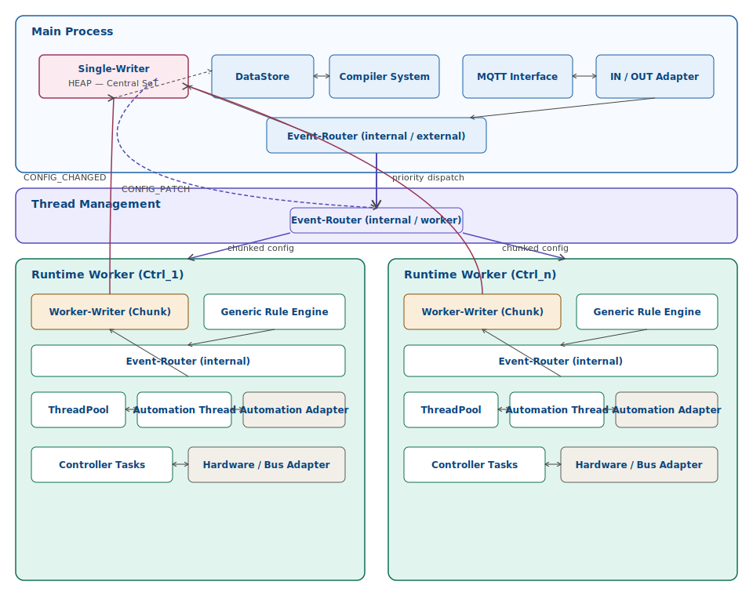
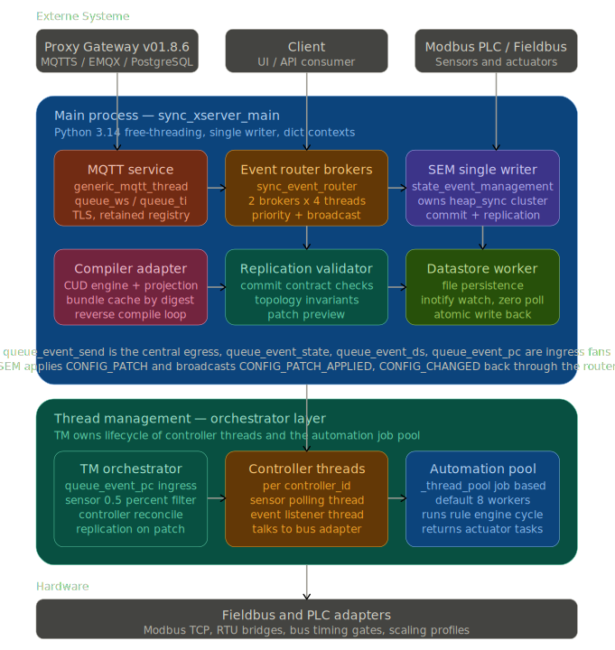
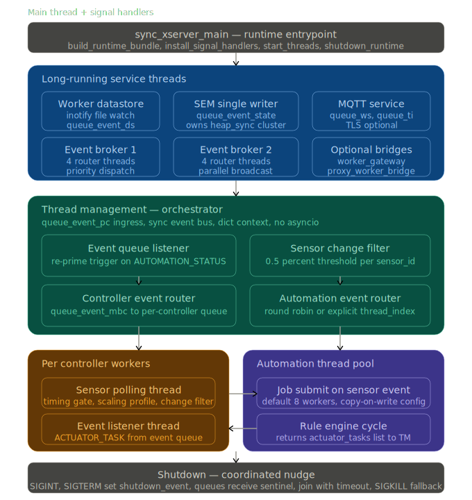

<<<<<<< HEAD
# Product Runtime v34.3 Preproduction Final Runtime

Status: **Pre-Production Ready**  
Package marker: `v34_3_preproduction_final_runtime`  
Runtime contract marker: `v34_preproduction_final_runtime`  
Validated with: **Product Proxy Gateway v01.8.6**, PostgreSQL, EMQX/MQTTS and one Modbus simulation server.

This repository package contains the runtime worker component and its release metadata. The proxy gateway, PostgreSQL/EMQX rollout package and Modbus simulation server are expected to be published as separate repositories.
=======
# Product Runtime v35.1 Preproduction Final Runtime

Status: **Pre-Production Ready / Controlled Pilot Ready**  
Package marker: `v35_1_preproduction_final_runtime`  
Runtime contract marker: `v35_1_preproduction_final_runtime`  
Validated locally with: `compileall` and `pytest`.

This repository contains the runtime worker component for the Centaurus-X industrial automation stack. The runtime remains a worker-side system: it uses configuration contracts, JSON/device-state input, memory-state resources, queues, MQTT/MQTTS bridge traffic and local runtime health snapshots. PostgreSQL is **not** a local worker runtime dependency; PostgreSQL backup/restore belongs to the external Proxy/Gateway instance.
>>>>>>> 862ba86 (Release runtime v35.1 preproduction final with PID liveness hotfix)

## GitHub release boundary

Publish the whole repository root, not only `product/`.

<<<<<<< HEAD
The root contains the runtime source tree plus installers, service templates, release documentation, contracts, reports, tools and license files. `product/` alone is useful for execution, but incomplete as a GitHub release.

Do not publish `_private/`. It is local-only development history and is excluded by `.gitignore`.

=======
The root contains runtime source code, installers, service templates, operational documentation, contracts, diagnostics reports, tools, GitHub governance files and licensing material. Do not publish `_private/`, caches, generated logs or local environment artifacts.
>>>>>>> 862ba86 (Release runtime v35.1 preproduction final with PID liveness hotfix)

## Architecture



<<<<<<< HEAD





Additional architecture artifacts:

- [Architecture documentation](documentation/architecture/sync_xserver_target_architecture/README.md)
- [Mermaid source](documentation/architecture/sync_xserver_target_architecture/sync_xserver_target_architecture.mmd)
- [HTML architecture viewer](documentation/architecture/sync_xserver_target_architecture/sync_xserver_target_architecture.html)


## Honest release status

The current integration state is production-like and functionally green. It is ready for a controlled production test, pilot run or pre-production deployment.

It is **not yet declared fully production-ready for unattended long-term operation**. The remaining hardening work is documented in:

```text
documentation/release/PREPRODUCTION_STATUS_V34_3.md
documentation/hardening/PRODUCTION_READINESS_GAP_LIST.md
documentation/hardening/QUICK_AND_DIRTY_HARDENING_PATCH_PLAN.md
```

## Validated live chain

```text
Client
  -> Proxy v01.8.6
  -> PostgreSQL registry/auth/audit
  -> MQTTS/EMQX
  -> Runtime v34.3 package / v34 preproduction command binding
  -> Modbus simulation path
  -> Runtime reply
=======


## Runtime chain

```text
Client
  -> Product Proxy Gateway
  -> EMQX/MQTTS
  -> Runtime Worker v35.1
  -> Runtime Command Binding
  -> Fieldbus profile / Modbus simulation subset
  -> Runtime Reply
>>>>>>> 862ba86 (Release runtime v35.1 preproduction final with PID liveness hotfix)
  -> Proxy
  -> Client
```

<<<<<<< HEAD
## Current acceptance result

```text
PostgreSQL v01.8.6: OK
MQTT/EMQX v01.8.6: OK
Proxy v01.8.6: OK
Runtime v34.3 package: OK
Runtime binding v34_preproduction_final_runtime: OK
Client E2E: OK
Registry/session tracking: OK
Modbus simulation server 192.168.0.3:5020: OK for the configured test subset
Full C1/C2/C3/C4 fieldbus matrix: intentionally not fully covered yet
```

The observed C3/C4 Modbus failures are expected in the current test setup because only one Modbus simulation server is active.

=======
Gateway-side PostgreSQL registry/auth/audit can be part of the complete external deployment chain, but it is not embedded in this worker package.

## What changed in v35.1

```text
- Runtime command marker migrated to v35_1_preproduction_final_runtime.
- Native bridge event type migrated to V35_1_PROXY_RUNTIME_COMMAND_RECEIVED.
- v34/v33/v32 command event names remain accepted as legacy compatibility events.
- MQTT auth, topic ACL, PKI/mTLS and certificate rotation metadata are configurable.
- Runtime health snapshots are written as JSON for monitoring/alerting integration.
- Fieldbus runtime profile can restrict active controllers to the currently simulated subset.
- PostgreSQL scope is corrected: Gateway/Proxy responsibility, no worker-local DB requirement.
- systemd, logrotate, smoke-test and host rollout scripts are updated for v35.1.
```

>>>>>>> 862ba86 (Release runtime v35.1 preproduction final with PID liveness hotfix)
## Main runtime entrypoint

```bash
cd product
python src/sync_xserver_main.py
```

<<<<<<< HEAD
For deployment, use the systemd installer:

```bash
bash installers/install_runtime_service.sh   --runtime-root /opt/projektstand_v34_3_preproduction_final_runtime
```

## Important runtime prerequisites

The runtime start path requires Python 3.14 free-threading / no-GIL.
=======
## Linux rollout

```bash
bash installers/deploy_runtime_host_v35_1.sh \
  --runtime-root /opt/projektstand_v35_1_preproduction_final_runtime \
  --runtime-python /opt/python-nogil/current/bin/python3 \
  --runtime-user product-runtime
```

Service-only install:

```bash
bash installers/install_runtime_service.sh \
  --runtime-root /opt/projektstand_v35_1_preproduction_final_runtime \
  --service-name product-runtime-v35-1.service
```

Health check:

```bash
bash installers/run_runtime_healthcheck.sh \
  --runtime-root /opt/projektstand_v35_1_preproduction_final_runtime
```

## Important runtime prerequisite

The real runtime service path expects a Python free-threading / no-GIL interpreter.
>>>>>>> 862ba86 (Release runtime v35.1 preproduction final with PID liveness hotfix)

```bash
python installers/check_python_free_threading.py
```

<<<<<<< HEAD
A normal Python build may run many unit tests, but the real runtime service is expected to reject non-free-threading execution.
=======
Unit tests can run on a normal Python interpreter, but the production service installer intentionally checks the free-threading runtime requirement.
>>>>>>> 862ba86 (Release runtime v35.1 preproduction final with PID liveness hotfix)

## Useful documentation

```text
documentation/README.md
documentation/directory_structure.md
<<<<<<< HEAD
documentation/operations/RUNTIME_ROLLOUT_GUIDE_V34_3.md
documentation/release/PREPRODUCTION_STATUS_V34_3.md
documentation/hardening/PRODUCTION_READINESS_GAP_LIST.md
documentation/hardening/QUICK_AND_DIRTY_HARDENING_PATCH_PLAN.md
documentation/github/GITHUB_RELEASE_PREPARATION.md
documentation/github/REPOSITORY_STRATEGY.md
reports/acceptance/V34_3_PREPRODUCTION_ACCEPTANCE_REPORT.md
reports/diagnostics/V34_3_OUTPUT_LOG_DIAGNOSIS.md
=======
documentation/operations/RUNTIME_ROLLOUT_GUIDE_V35_1.md
documentation/operations/RUNTIME_TEST_PLAN_V35_1.md
documentation/release/PREPRODUCTION_STATUS_V35_1.md
documentation/release/RELEASE_NOTES_V35_1.md
documentation/hardening/ONE_STEP_FINISHING_PLAN_V35_1.md
documentation/hardening/POSTGRESQL_SCOPE_CLARIFICATION_V35_1.md
reports/acceptance/V35_1_PREPRODUCTION_ACCEPTANCE_REPORT.md
reports/diagnostics/V35_1_REPOSITORY_AND_RUNTIME_DIAGNOSIS.md
Diff-System-Report.md
>>>>>>> 862ba86 (Release runtime v35.1 preproduction final with PID liveness hotfix)
```

## Licensing

This project is intended to be distributed under a dual licensing model:

```text
GPL-3.0-or-later OR Commercial License
```

See `LICENSE.md` and `COMMERCIAL_LICENSE.md`.
<<<<<<< HEAD

=======
>>>>>>> 862ba86 (Release runtime v35.1 preproduction final with PID liveness hotfix)
